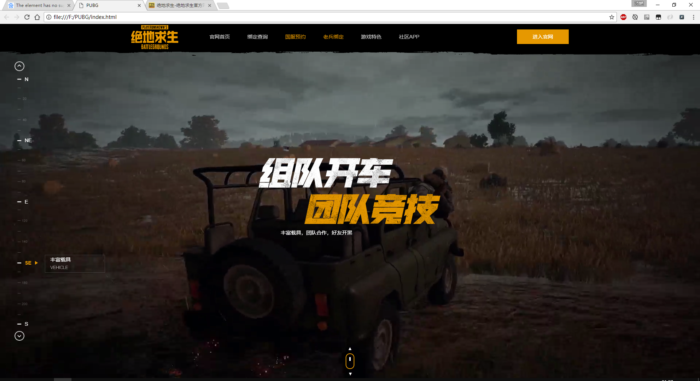

# 仿绝地求生腾讯官方网站

> 网站仿下来大概只完成了60%，完成了整体框架，全屏页面的滚动，侧栏及跳转，头部，底部，部分标题图片。虽然许多细节并没有做（每一个场景的详情介绍显示，天气场景以及其动画），但是大概的样子还是能看能接受的，由于个人技术与经验问题，进度暂且搁置于此。  

[原始网站请戳我](http://pubg.qq.com/)

本次仿站只用了Jquery进行DOM的操作，将原始的transform动画滚动改为top属性上的动画滚动（这里是因为考虑有所欠缺，用transform更好）。

而且由于跟原始网站一样，对`video`标签使用了`object-fit`的CSS属性，IE或者EDGE浏览器使用体验会有所下降。

这次仿站下来，觉得自己动画使用方面需要再加强，也学到了很多新的CSS小技巧。